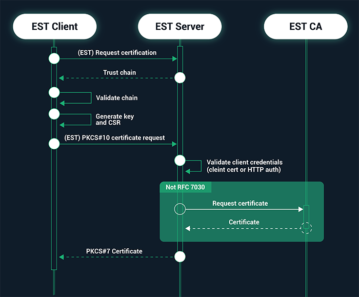

# EST_Service

A basic outline of the EST Service is outlined by:

1. Setting Up the EST Client
- - Establish a secure connection with the EST Server using TLS.
- - Validate the server's certificate using a predefined trust store.
- - If trust is established, proceed with generating a public/private key pair.
- - Create a Certificate Signing Request (CSR) using the generated key pair.
- - Send the PKCS#10 CSR request to the EST Server over HTTPS.

2. Handling the Request on the EST Server
- - Receive the incoming certificate request (CSR) from the EST Client.
- - Verify the client's credentials:
- - Use TLS client authentication (mutual TLS).
- - Alternatively, use HTTP-based authentication (e.g., Basic Auth, OAuth).
- - If authentication is successful, extract the CSR details.
- - Forward the CSR to the Certificate Authority (CA).

3. Interacting with the Certificate Authority (CA)
- - Package the CSR into a request that the CA understands (e.g., SCEP, ACME, or REST API call).
- - Submit the request to the CA for certificate issuance.
- - Wait for a response from the CA.
- - If approved, retrieve the issued certificate in PKCS#7 format.

4. Returning the Certificate to the EST Client
- - Send the issued certificate back to the EST Client over a secure TLS connection.
- - Ensure that the certificate is formatted correctly (e.g., PEM, DER).
- - The client receives and installs the certificate for future authentication and encryption use.

5. Additional Features (Optional Enhancements)
- - Implement automatic renewal of certificates before expiration.
- - Provide audit logging of issued certificates and requests.
- - Enable support for Bootstrap EST, allowing devices without initial certificates to enroll securely.
- - Offer a graphical or CLI-based client for easy certificate enrollment.

VERY MUCH UNDER CONSTRUCTION

Source: Sectigo
